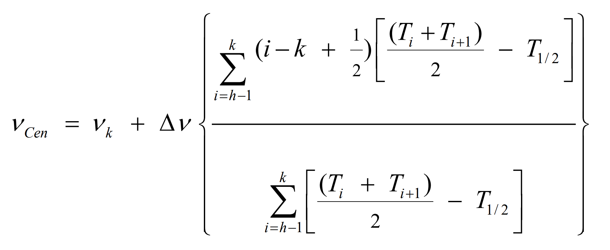

# automated-spectrometer-calibration

This MATLAB code automates the calibration of a Fourier-Transform infrared (FTIR) spectroscope.

This is done by placing a standard reference material into the spectroscope, measuring its transmittance spectrum, and then comparing the values at the peaks with those expected.

However, the transmittance spectrum is a graph made up of finite points, so to find the peak values, the centroid method should be used to average points around the peaks.

The code automatically identifies peaks based on an estimate of their position, and applies the centroid method to measure how well-calibrated the spectroscope is.

The following images have been reproduced from https://www-s.nist.gov/srmors/certificates/1921b.pdf, which contains the full methodology.

Transmittance spectrum:

Centroid method:

